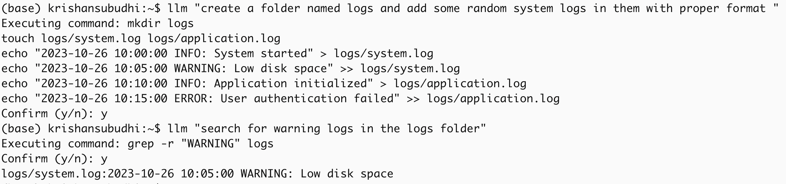

# Bash LLM

This project allows you to interact with language models like OpenAI's GPT and Gemini from the command line.

## Getting Started

### 1. Clone the Repository and Install Requirements

Clone the repository to your local environment and install the necessary packages by running:

```bash
pip install -r requirements.txt
```

### 2. Configure API Keys

You'll need an API key from either OpenAI or Gemini to use this tool. Follow the steps below for each service you wish to configure.

#### OpenAI Configuration

1. [Create a new OpenAI API key](https://platform.openai.com/docs/quickstart/create-and-export-an-api-key) if you don't have one already.
2. Create a `.env` file in the root directory of this repository and add your OpenAI API key:
   ```bash
   OPENAI_API_KEY=your_openai_key_here
   ```

#### Gemini Configuration

1. [Obtain a Gemini API key](https://ai.google.dev/gemini-api/docs/api-key) from the Gemini platform.
2. Add your Gemini API key to the `.env` file:
   ```bash
   GEMINI_API_KEY=your_gemini_key_here
   ```

### 3. Configure the Model Provider

To specify which model to use by default, change the model provider in `config.ini`

```
model_provider = openai
```

### 4. Testing Your Setup

To test the setup, run:

```bash
python main.py "Who are you?"
```

This should display a response from the model specified in `config.ini`. To switch between Gemini and OpenAI, update the `model_provider` in `config.ini`.

### 5. Set Up an Alias (Optional)

For easier usage, create an alias in your shell configuration file to call this tool directly from the command line.

1. Open your `.bashrc` (or `.zshrc` for Zsh users) and add an alias, replacing `/path/to/repo` with the path to your cloned repository:
   ```bash
   echo "alias llm='python /path/to/repo/main.py'" >> ~/.bashrc
   source ~/.bashrc
   ```
2. Now you can use the alias to call the model directly from the command line:
   ```bash
   llm How to find all Python files in this directory?
   ```

    
